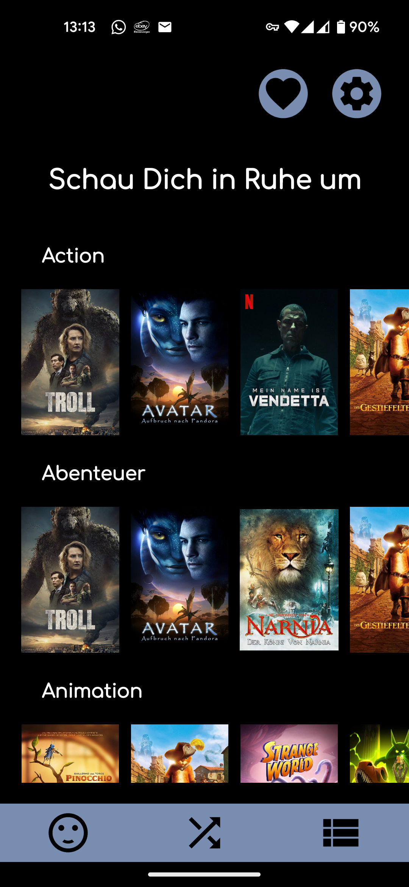
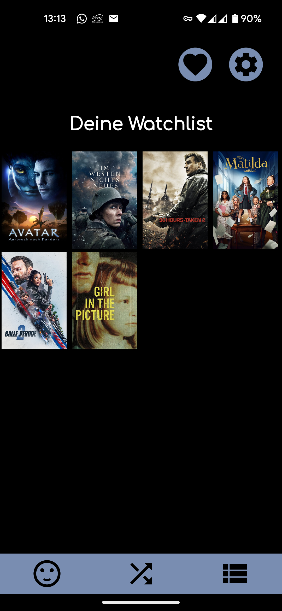
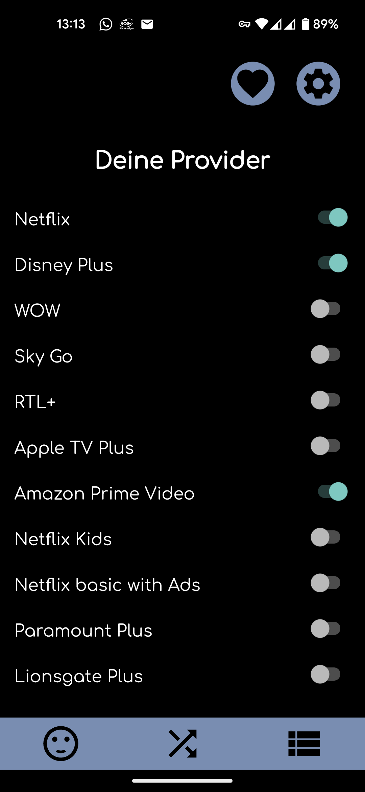
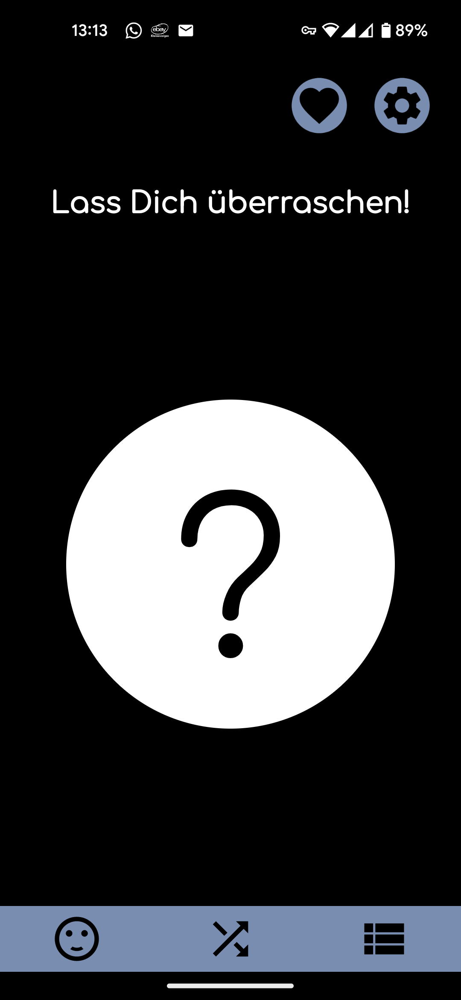
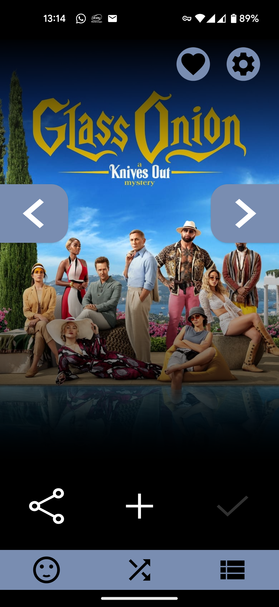
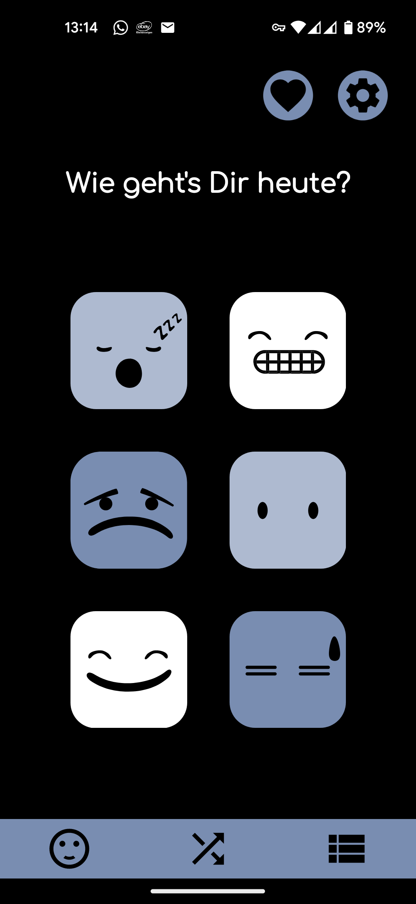

# Whatch

## Description
A free Android app to find new movies that are available on your Streaming platforms.

All data is fetched from the open TMDB database API.

## Features
* Get a random movie suggestion.
* Sort by genre.
* Get a suggestion based on your mood. 
* Set your streaming providers and only see movies that are available on those. 
* Add movies to a watchlist. 

## Screenshots

## Download
Download the current APK from the releases tab.

## Attribution
All the movie data is from the TMDB Database. 

3

## Contributors
This a project was created as a part of the 2022/23 Software Engineering course at the HAW Hamburg guided by Thorben Ortmann.